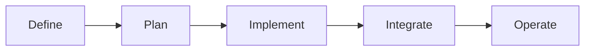

# Value Stream Map - Product Engineering AI Adoption

Inspired by Gorka's map format, adapted for product engineering teams.

## Legend

- `AI Active`: already used by the team.
- `AI Possible`: good candidate for near-term adoption.
- `N/A`: not worth automating with AI in current context.

## Stage 1 - Define

| # | Task | AI Status | Notes |
|---|---|---|---|
| 1 | Capture organizer or internal business need | AI Active | Use AI to summarize interviews, support tickets, and incident context. |
| 2 | Write problem statement and user story | AI Active | Co-draft alternatives and improve clarity of acceptance boundaries. |
| 3 | Define acceptance criteria | AI Possible | Use AI to generate edge cases and non-happy-path criteria. |
| 4 | Assess design and technical constraints | AI Possible | Use AI for risk prompts, dependency checks, and architecture prompts. |
| 5 | Estimate complexity and delivery risk | AI Possible | Use AI for complexity heuristics, then validate with team judgment. |
| 6 | Prioritize and move to sprint | N/A | Final prioritization remains product and engineering leadership decision. |

## Stage 2 - Plan

| # | Task | AI Status | Notes |
|---|---|---|---|
| 7 | Create branch and implementation draft | AI Active | AI proposes implementation outline by component and service impact. |
| 8 | Create technical plan | AI Active | AI drafts plan with dependencies, migrations, and rollback notes. |
| 9 | Split into small tasks | AI Active | Generate vertical slices and thin pull requests. |
| 10 | Detect dependencies and risks | AI Active | Prompt AI for integration, security, and data integrity risk scans. |
| 11 | Prepare test strategy | AI Possible | AI proposes unit/integration/e2e cases and critical regression paths. |

## Stage 3 - Implement

| # | Task | AI Status | Notes |
|---|---|---|---|
| 12 | Implement first slice with AI pairing | AI Active | Keep scope small and incremental. |
| 13 | Iterate and refine generated code | AI Active | Improve naming, simplify logic, and tighten typing. |
| 14 | Generate and run tests | AI Active | Use AI to draft tests first and close obvious gaps. |
| 15 | Commit with semantic message | AI Active | AI suggests concise, meaningful commit messages. |
| 16 | Verify quality and coverage | AI Possible | AI helps detect weak tests and repeated logic patterns. |
| 17 | Resolve integration conflicts | AI Active | AI assists in conflict resolution and compatibility checks. |

## Stage 4 - Integrate

| # | Task | AI Status | Notes |
|---|---|---|---|
| 18 | Open pull request | AI Active | Generate PR title/body, test plan, and rollout notes. |
| 19 | Auto-review the PR | AI Active | Use AI review for bugs, regressions, and missing test coverage. |
| 20 | Address reviewer feedback | AI Active | Summarize comments and produce targeted fixes quickly. |
| 21 | Update Jira and release notes | AI Possible | AI can draft updates, owner confirms final wording. |
| 22 | Human functional review | N/A | Final product confidence gate remains human owned. |
| 23 | Merge and deploy to staging | AI Active | AI supports deployment checklist and rollback validation prompts. |

## Stage 5 - Operate

| # | Task | AI Status | Notes |
|---|---|---|---|
| 24 | Monitor production behavior | AI Active | AI-assisted triage from logs, alerts, and traces. |
| 25 | Diagnose and reproduce bugs | AI Active | AI helps create repro hypotheses and test scenarios. |
| 26 | Handle internal support requests | AI Possible | AI suggests resolution paths from known incidents and docs. |
| 27 | Update technical documentation | AI Active | Draft changelog, runbooks, and troubleshooting updates. |
| 28 | Run team retrospective | AI Possible | Summarize themes and action items from retro notes. |
| 29 | Improve team AI rules and prompts | AI Active | Capture what worked, remove noise, raise quality bar. |
| 30 | Evaluate new AI capabilities quarterly | AI Possible | Controlled experiments before broad adoption. |

## Initial Baseline (Proposed)

- AI Active: 18 tasks
- AI Possible: 10 tasks
- N/A: 2 tasks

This baseline should be re-measured each sprint and tracked as a trend, not as a static score.

## Optional Mermaid View

