# Eventbrite Supply AI Adoption Board (Visual)

Use this file as the visual companion to the value stream map.

## Status Colors

- Green: `AI Active`
- Yellow: `AI Possible`
- Gray: `N/A`

## Mermaid Board

```mermaid
flowchart LR
  %% Stage 1
  subgraph S1[ETAPA 1 - DEFINE]
    D1["01 Capture business need"]
    D2["02 Problem statement + user story"]
    D3["03 Acceptance criteria"]
    D4["04 Design + tech constraints"]
    D5["05 Complexity + risk estimate"]
    D6["06 Prioritize and move to sprint"]
  end

  %% Stage 2
  subgraph S2[ETAPA 2 - PLAN]
    P7["07 Branch + implementation draft"]
    P8["08 Technical plan"]
    P9["09 Split into small tasks"]
    P10["10 Detect dependencies + risks"]
    P11["11 Test strategy"]
  end

  %% Stage 3
  subgraph S3[ETAPA 3 - IMPLEMENT]
    I12["12 Implement first slice"]
    I13["13 Iterate generated code"]
    I14["14 Generate + run tests"]
    I15["15 Semantic commit"]
    I16["16 Quality + coverage checks"]
    I17["17 Resolve integration conflicts"]
  end

  %% Stage 4
  subgraph S4[ETAPA 4 - INTEGRATE]
    G18["18 Open pull request"]
    G19["19 AI-assisted PR review"]
    G20["20 Address reviewer feedback"]
    G21["21 Update Jira + release notes"]
    G22["22 Human functional review"]
    G23["23 Merge + deploy to staging"]
  end

  %% Stage 5
  subgraph S5[ETAPA 5 - OPERATE]
    O24["24 Monitor production behavior"]
    O25["25 Diagnose + reproduce bugs"]
    O26["26 Internal support handling"]
    O27["27 Update technical docs"]
    O28["28 Retrospective insights"]
    O29["29 Improve AI rules + prompts"]
    O30["30 Evaluate new AI capabilities"]
  end

  %% Stage flow
  S1 --> S2 --> S3 --> S4 --> S5

  %% Status classes
  classDef active fill:#0d3b2e,stroke:#2db980,color:#ffffff,stroke-width:1px;
  classDef possible fill:#4a3b06,stroke:#facc15,color:#ffffff,stroke-width:1px;
  classDef na fill:#2b2f36,stroke:#9ca3af,color:#ffffff,stroke-width:1px;

  %% Active
  class D1,D2,P7,P8,P9,P10,I12,I13,I14,I15,I17,G18,G19,G20,G23,O24,O25,O27,O29 active;

  %% Possible
  class D3,D4,D5,P11,I16,G21,O26,O28,O30 possible;

  %% N/A
  class D6,G22 na;
```

## Snapshot KPIs

- Total tasks: `30`
- `AI Active`: `18` (60%)
- `AI Possible`: `10` (33%)
- `N/A`: `2` (7%)

## How to Update (Sprint)

1. Update status classes in this Mermaid board.
2. Update the numeric KPIs in this file.
3. Sync task notes in `eventbrite-supply-ai-value-stream-map.md`.
4. Record what changed in `PROJECT_STATUS.md`.
